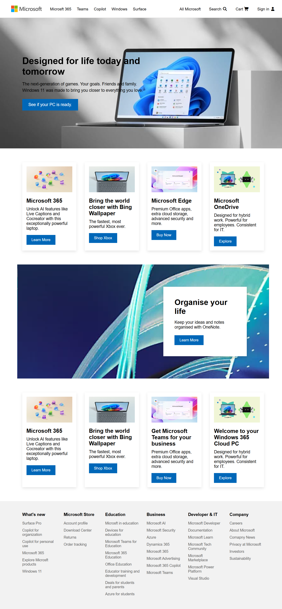

# 💻 Microsoft Homepage Clone

A responsive **Microsoft Homepage Clone** built using **HTML5** and **CSS3**. This project recreates the modern Microsoft landing page with a clean user interface, responsive design, and pixel-perfect layout. It was developed to improve frontend development skills by practicing real-world website cloning techniques.

## ✨ Features

- 🎨 Modern Microsoft-inspired UI
- 🖼️ Hero banner section
- 📦 Product cards with hover effects
- 📢 Promotional banner section
- 📂 Multi-column footer
- ⚡ Smooth and clean layout
- 💻 Built with semantic HTML5 and CSS3
- 🌐 Cross-browser compatible

## 🛠️ Technologies Used

- HTML5
- CSS3

## 📸 Preview

## 🚀 Live Demo

🌐 **Live Website:** https://maziaramzan80.github.io/Microsoft-Clone-using-HTML-CSS/

## 📚 What I Learned

Through these projects, I improved my understanding of:

- Semantic HTML5 structure
- Responsive Web Design
- CSS Flexbox
- CSS Grid
- Media Queries
- Image positioning
- Typography and spacing
- Component-based layouts
- Professional UI implementation

## 👩‍💻 Author

**Mazia Ramzan**
**Frontend Web Developer**
- GitHub: https://github.com/maziaramzan80
- LinkedIn: https://www.linkedin.com/in/mazia-ramzan-8aa7b4342?utm_source=share_via&utm_content=profile&utm_medium=member_android
- Instagram: https://www.instagram.com/web_canvas_?igsh=eXppZ2FjbWsweDlo

## ⭐ Support

If you found this project helpful or inspiring, please consider giving it a **⭐ Star** on GitHub. Your support motivates me to continue building more frontend development projects.
